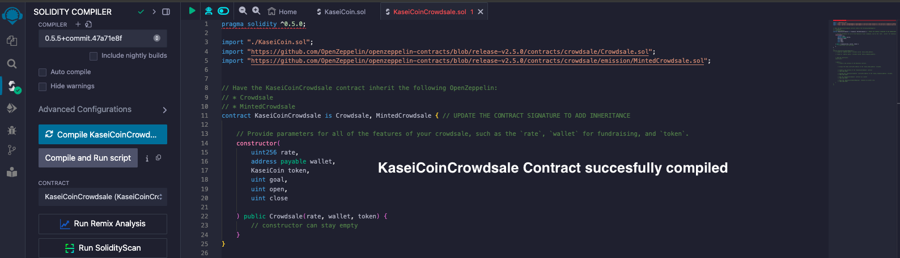
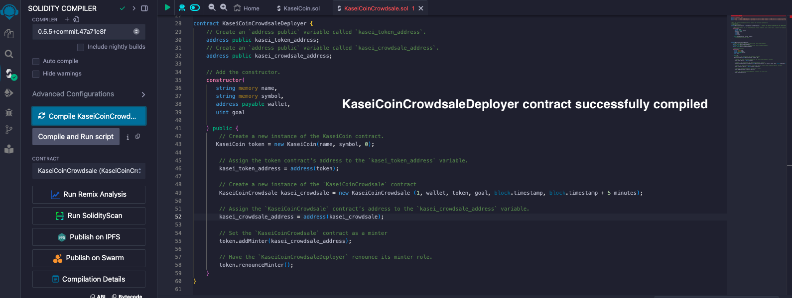

# KaseiCoin

## Project Overview

The KaseiCoin project involves creating a new cryptocurrency, **KaseiCoin**, which is based on blockchain technology and is ERC-20 compliant. KaseiCoin will be distributed via a crowdsale, allowing users to convert their currency into KaseiCoin. This project includes developing smart contracts for the KaseiCoin token, the crowdsale, and the deployment process, using Solidity and OpenZeppelin libraries.

## Project Components

The project is divided into the following key components:

### 1. KaseiCoin Token Contract
- **Purpose:** Define KaseiCoin as an ERC-20 token, ensuring it is fungible, mintable, and compliant with Ethereum standards.
- **OpenZeppelin Libraries Used:**
  - `ERC20`
  - `ERC20Detailed`
  - `ERC20Mintable`
- **Features:**
  - The contract includes a constructor to initialize the token with a name, symbol, and decimal value.
  - The contract allows for minting of new tokens, which will be necessary during the crowdsale.

### 2. KaseiCoin Crowdsale Contract
- **Purpose:** Manage the crowdsale process, allowing users to purchase KaseiCoin tokens using Ether (ETH).
- **Libraries Used:**
  - `Crowdsale`
  - `MintedCrowdsale`
- **Features:**
  - Users can send Ether to the contract to receive KaseiCoin tokens in return.
  - The contract automatically mints tokens and sends them to buyers in one transaction.
  - Parameters like rate, wallet, and token are configurable to set up the crowdsale.

### 3. KaseiCoin Deployer Contract
- **Purpose:** Deploy the KaseiCoin token and crowdsale contracts on the blockchain.
- **Features:**
  - Deploys the KaseiCoin token with an initial supply of 0.
  - Deploys the KaseiCoin crowdsale contract with a specified rate, wallet address, and token address.
  - Assigns the crowdsale contract as the minter for the KaseiCoin tokens.
  - Renounces the deployer's minter role after setup to ensure decentralization.

### 4. Deployment and Testing
- **Tools Used:**
  - Remix IDE for smart contract development and compilation.
  - MetaMask for interacting with the Ethereum blockchain.
  - Ganache for local blockchain simulation.
- **Steps:**
  - The contracts were deployed to a local blockchain using Remix, MetaMask, and Ganache.
  - Functionality was tested by simulating the purchase of KaseiCoin tokens using test accounts.
  - The total supply of tokens and the amount of Ether raised by the crowdsale were verified.

## Evaluation Evidence

In this section, you will find the evidence that demonstrates the successful completion of the project:

1. **Smart Contract Compilation:**
   - Screenshots of successful contract compilations for KaseiCoin, KaseiCoinCrowdsale, and KaseiCoinCrowdsaleDeployer.

  

  

  

2. **Contract Deployment:**
   - Video showing the deployment process on a local blockchain.

https://github.com/user-attachments/assets/55fe82ea-f47e-43a8-925d-2f4a7a72fb05

   

## Conclusion

The KaseiCoin project provides a scalable and transparent method for managing digital currency using blockchain technology and the Ethereum network. The successful deployment of KaseiCoin and its crowdsale paves the way for future developments and enhancements in digital finance.

